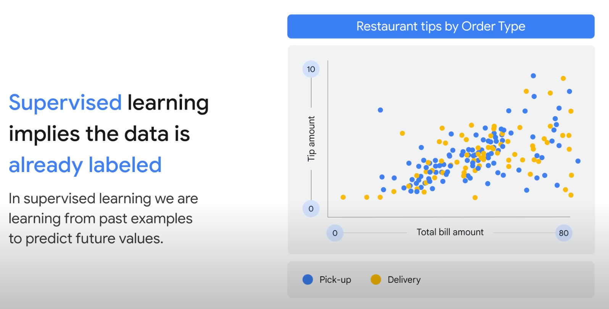
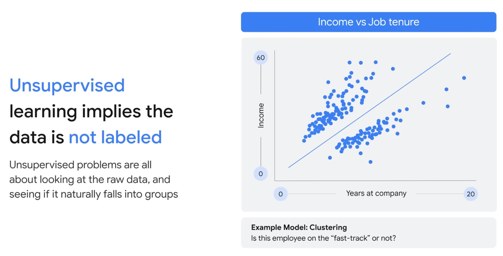
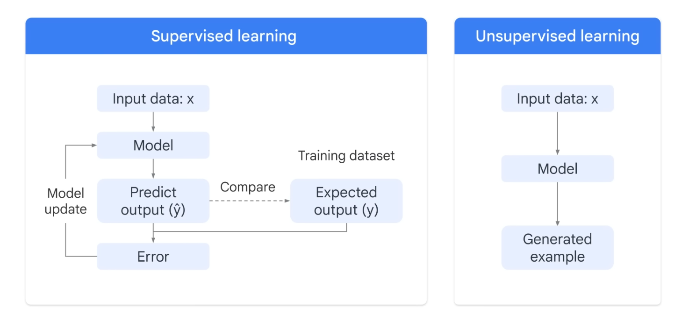
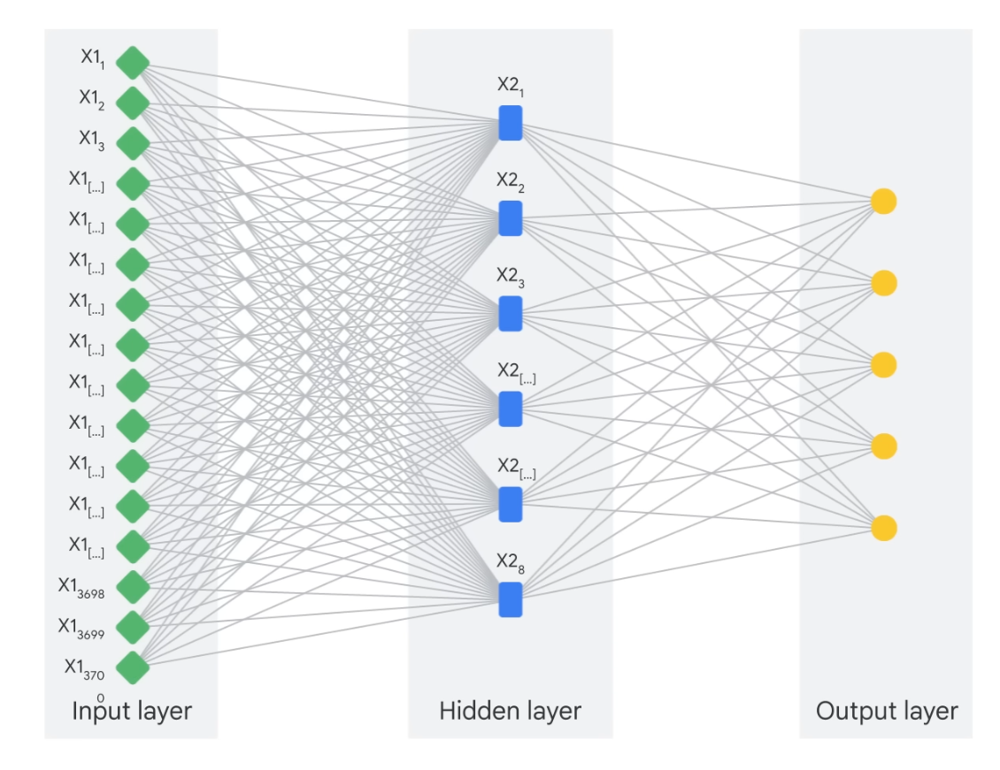

# Generative AI

Generative AI is a type of artificial intelligence technology that can provide different type of content.

## Artifical Intelligence

AI is the theory and development of computer systems able to **perform tasks normally requiring human intelligence**.

## Machine Learning

Meanwhile, machine learning is a program or system that trains a model based on input dat, giving the computers the abiility to learn without explict programming. For example, we have unsupervised ML and supervised ML models.

## Deep Learning

Deep learning uses Aritifical Neural Networks - allowing them to process more complex patterns than traditional machine learning. Inspired by the human brain.

## Generative AI

Generative AI is a subset of Deep Learning, using artificial neural network, process both labelled and unlablled data using supervised, unsupervised, semi-supervised methods.

- GenAI is a type of AI that creates new content based on what it has learned from existing content
- The process of learning from existing content is called training and results in the creation of a statistical model
- When given a prompt, Gen AI uses this statistical model to predict what an expected response might be-and this generates new content

### Models:

Generative:

- Generates new data that is similar to data it was trained on
- Understands distribution of data and how likely a given example is
- Predict next word in a sequence
- Generate new data instances

Discriminative:

- Used to classify or predict
- Typically trained on a dataset of labeled data
- Learns the relationship between the features of the data points and the labels

Build foundational language model and simply use by asking simple questions.

# Tools Available:

- [Generative AI Studio by Google](https://cloud.google.com/generative-ai-studio)
